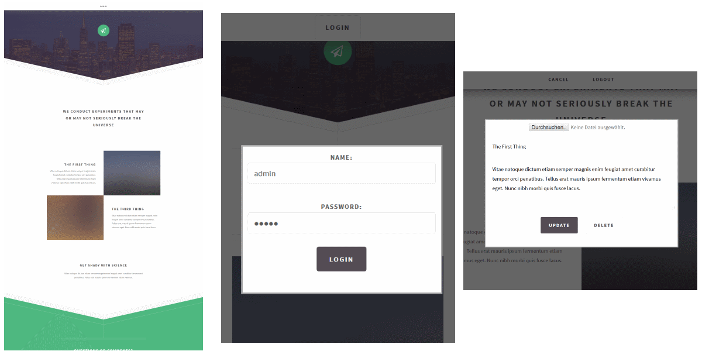

# A Sample application for Apache Sling
This project demonstrates core concepts and features of the Apache Sling&trade; web framework. 
It provides a demonstrative mini-CMS application for the beautiful responsive _directive_ template set by [http://html5up.net](http://html5up.net). 
The application was created as part of an article about Sling featured in the German [Java Magazin](https://jaxenter.de/magazine/java-magazin).

## What this sample application is
This application demonstrates how resources in the JCR can be created and modified using REST. It shows how Sling's view mechanism can be leveraged to generate different
representations of the same resource. It showcases a more advanced programmatic JCR ACL setup to allow content creation by anonymous users. Furthermore, it is demonstrate
how JCR observation allows handling of resource modification events using the Sling Job framework.

## What this sample application is _not_
A ready-to-use CMS / web application. It has purely been designed to demonstrate Sling features.
 
## How to run this application
1. Download the Sling 7 Standalone Application from the [official download page](https://sling.apache.org/downloads.cgi)
2. Run the standalone jar using JDK 7 - this will install and start sling, e.g. with debugging on port 30303 using 
   `java.exe -agentlib:jdwp=transport=dt_socket,server=y,suspend=n,address=30303 -Xmx1700m -XX:MaxPermSize=256m -jar`. 
   Handy hint: Tail the error.log in sling/logs - this is the bewst way to see what is happening under the hood.
4. Clone this repo and run `mvn install sling:install` - this will install the application to a sling instance at localhost:8080
5. Open [http://localhost:8080/javamagazin.html](http://localhost:8080/javamagazin.html).
6. You may login with any sling user, e.g. using admin/admin for the default administrative account.